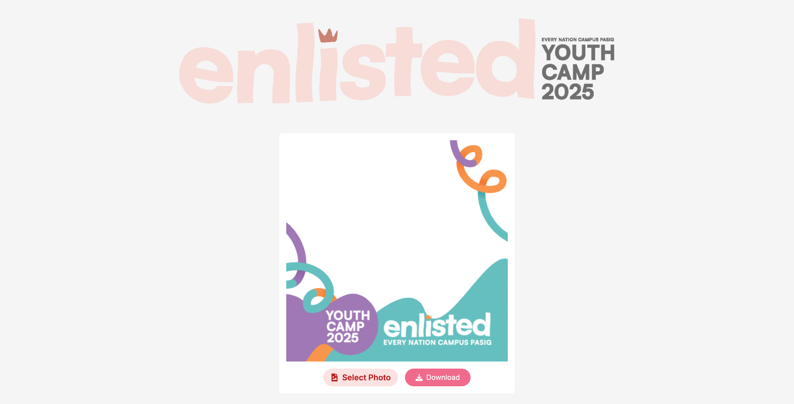

# [enlisted-pfp-frame](https://enlisted-pfp-frame.vercel.app)

Create and customize your own twibbons effortlessly with our user-friendly web application.

[](https://enlisted-pfp-frame.vercel.app)

## How it Works

This application allows users to create personalized twibbons for various events, campaigns, or celebrations. The process is straightforward:

1. The user selects or uploads an image.
2. They can then customize the twibbon by adding text, stickers, or other elements.
3. Once satisfied, the user can download the twibbon or share it directly on social media.

## Getting Started

### Prerequisites

- Node.js installed on your machine.

### Installation

1. Clone this repository:
   ```bash
   git clone https://github.com/CPTimario/enlisted-pfp-frame.git
   ```
2. Navigate into the project directory:
   ```bash
   cd enlisted-pfp-frame
   ```
3. Install the dependencies:
   ```bash
   pnpm install
   ```

### Running the Application

1. Start the development server:
   ```bash
   pnpm run dev
   ```
2. Open your browser and go to `http://localhost:3000` to see the application in action.

### Attribution

This project is based on work from [here](https://github.com/irfan-za/bikin-twibbon) by [irfan-za].
